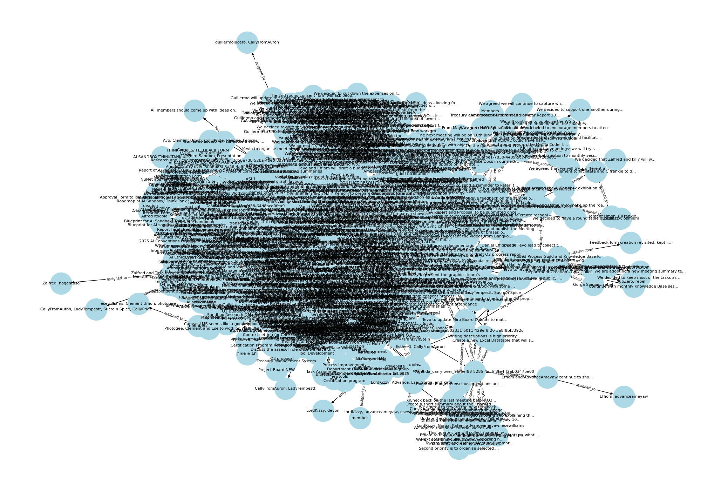

# Graph-Python-scripts

This repository is for testing Python Scripts

## Project Overview

This workspace contains Python scripts for visualizing meeting data as directed graphs using NetworkX and Matplotlib.

### Nodes-Edges.py

- **Purpose:**  
  Fetches a single meeting summary from a remote JSON file, parses its structure, and builds a directed graph representing relationships between workgroups, meetings, people, documents, agenda items, actions, decisions, tags, and emotions.
- **Key Steps:**  
  1. Downloads JSON data from a URL.
  2. Handles both list and dict JSON structures.
  3. Safely extracts nested fields.
  4. Adds nodes and edges for all relevant entities.
  5. Saves the resulting graph visualization as `graph.png`.


### Nodes-Edges2.py

- **Purpose:**  
  Processes an array of meeting summaries from a remote JSON file, building a directed graph that includes all workgroups and their associated meetings, people, documents, agenda items, actions, decisions, tags, and emotions.
- **Key Steps:**  
  1. Downloads JSON data from a URL.
  2. Handles both dict and list JSON structures, but always iterates through a list of workgroups.
  3. Safely extracts nested fields for each workgroup.
  4. Adds nodes and edges for all entities across all meetings.
  5. Saves the resulting graph visualization as `graph2.png`.



---

**Note:**  
Both scripts reference `meeting-summaries-array.json` as their data source, **not** `meeting-summaries-by-id.json`.  
They are designed for headless environments (such as dev containers). The graph images are saved to disk and can be viewed using the default browser with:

```bash
$BROWSER graph.png
$BROWSER graph2.png
```

### GEXF-Export Script
### GEXF-export.py

- **Purpose:**  
  Fetches all meeting summaries from a remote JSON file, builds a comprehensive directed graph of workgroups, meetings, people, documents, agenda items, actions, decisions, tags, and emotions, and exports the graph to a GEXF (Graph Exchange XML Format) file for further visualization and analysis in tools such as Gephi.

- **Key Steps:**  
  1. Downloads JSON data from a URL and normalizes it to a list of workgroups.
  2. Iterates through all workgroups, extracting and sanitizing relevant entities and relationships.
  3. Forces `meeting_node_id` to be unique by appending the top-level index when `workgroup_id` is missing or not unique.
  4. Ensures all node IDs are strings for compatibility.
  5. Adds nodes and edges for workgroups, meetings, people, documents, agenda items, actions, decisions, tags, and emotions.
  6. Sanitizes all node and edge attributes to ensure compatibility with the GEXF format.
  7. Prints counts of nodes and edges before and after sanitization, and prints sample node IDs so you can confirm the graph structure.
  8. Exports the resulting graph to `all_workgroups_graph_sanitized.gexf`.
  9. Optionally visualizes the graph in Python using Matplotlib.

The script prints diagnostic information about the graph structure and attribute types before and after sanitization, ensuring the exported GEXF file is valid and ready for use in Gephi or other graph analysis tools.
